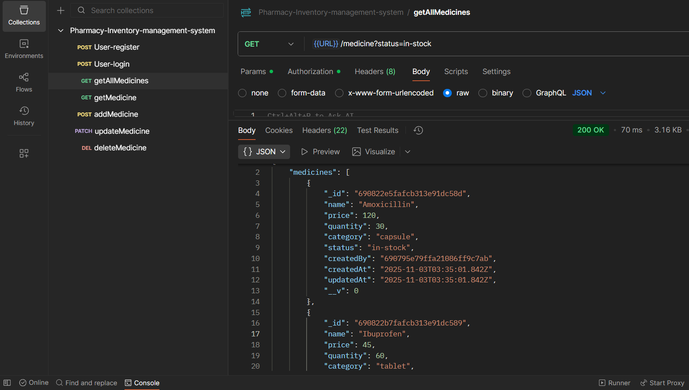

# 💊 Pharmacy Inventory Management System

A **Node.js + Express + MongoDB** backend project to manage a pharmacy’s medicines efficiently.  
This system helps store owners keep track of medicines, expiry dates, stock levels, and pricing — acting as a **digital diary** for their pharmacy.

---

## 🚀 Live Demo

🔗 **Render Deployment:** [https://your-app-name.onrender.com](https://your-app-name.onrender.com)

---

## 🧠 Features

- ➕ Add, update, delete, and view medicines
- 🔍 Search medicines by **name**, **category**, or **status**
- 🕒 Track expiry status: `in-stock`, `out-of-stock`, `expired`
- 🔐 Authentication system (Owner login)
- ✅ **Joi** validation for input fields
- 🧾 Tracks `createdAt` and `updatedAt`
- 🧱 Proper error handling middleware
- 🛡️ Secure with Helmet, CORS and Rate Limiting

---

## 🖼️ Project Preview

### 📮 API Testing (Postman)



---

## ⚙️ Tech Stack

| 🏗️ Layer           | 💡 Technology                    |
| ------------------ | -------------------------------- |
| 🔙 Backend         | Node.js, Express.js              |
| 🗄️ Database        | MongoDB (Mongoose)               |
| 🧾 Validation      | Joi                              |
| 🛡️ Security        | Helmet, CORS, Express-rate-limit |
| ☁️ Deployment      | Render                           |
| 🧭 Version Control | Git & GitHub                     |

---

## 📡 API Endpoints

### 🧍 Authentication Routes

| Method | Endpoint             | Description                                  |
| :----: | :------------------- | :------------------------------------------- |
| `POST` | `/api/auth/register` | 📝 Register a new user (owner)               |
| `POST` | `/api/auth/login`    | 🔐 Login existing user and receive JWT token |

---

### 💊 Medicine Management Routes

|  Method  | Endpoint             | Description                         |
| :------: | :------------------- | :---------------------------------- |
|  `POST`  | `/api/medicines`     | ➕ Add a new medicine               |
|  `GET`   | `/api/medicines`     | 📋 Get all medicines                |
|  `GET`   | `/api/medicines/:id` | 🔍 Get details of a single medicine |
| `PATCH`  | `/api/medicines/:id` | ✏️ Update medicine details          |
| `DELETE` | `/api/medicines/:id` | 🗑️ Delete a medicine                |

---

### 🔎 Search & Filter

| Method | Endpoint                              | Description                   |
| :----: | :------------------------------------ | :---------------------------- |
| `GET`  | `/api/medicines?status=expired`       | 🔍 Get all expired medicines  |
| `GET`  | `/api/medicines?status=out-of-stock`  | 🚫 Get out-of-stock medicines |
| `GET`  | `/api/medicines?category=pain-relief` | 🧾 Get medicines by category  |
| `GET`  | `/api/medicines?name=paracetamol`     | 🔎 Search by medicine name    |

---

### Example Response

```json
{
  "success": true,
  "data": {
    "_id": "672e8f90c75f02b7cc8b9a43",
    "name": "Paracetamol",
    "category": "Pain Relief",
    "quantity": 50,
    "price": 25,
    "status": "in-stock",
    "createdBy": "671e12eac1f05e4ff4b9fbc2"
  }
}
```

---

## 🧰 Installation & Setup

### 1️⃣ Clone the repository

```Bash

git clone https://github.com/yourusername/pharmacy-inventory-management-system.git

```

### 2️⃣ Navigate to project folder

```

cd pharmacy-inventory-management-system

```

### 3️⃣ Install dependencies

```

npm install

```

### 4️⃣ Create .env file and add environment variables

Create a `.env` file in your project root and add the following:

```env
PORT=5000                    # (or any port you prefer)
MONGO_URI=your_mongodb_connection_string   # (replace with your own MongoDB URI)
JWT_SECRET=your_secret_key   # (choose any strong secret)
JWT_LIFETIME=1d              # (or your wish — e.g., 2d, 7d)
```

_(Never push this file to GitHub — it’s already ignored using `.gitignore`.)_

### 5️⃣ Run the server

```

npm start

```

---

## 🧪 Test the API in Postman

- This project is backend-only, so test all endpoints using Postman.

- Register or log in to get a JWT token.

- In Postman, go to the Authorization tab → choose Bearer Token → paste the token.

- Now you can access protected routes like /api/v1/medicine.

- Public routes like /api/v1/public/medicines don’t need authentication.

---

## 🧤 Security Middleware Used

| Middleware                    | Purpose                                       |
| ----------------------------- | --------------------------------------------- |
| **Helmet**                    | Secures HTTP headers                          |
| **CORS**                      | Enables cross-origin resource sharing         |
| **express-rate-limit**        | Prevents brute-force attacks                  |
| **app.set('trust proxy', 1)** | Ensures correct client IP detection on Render |
